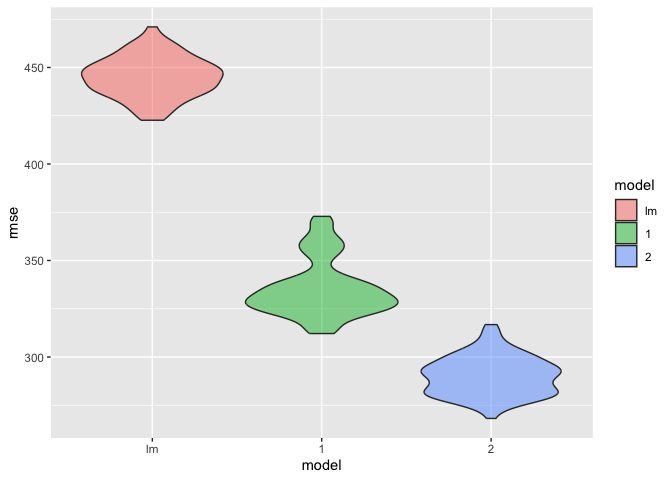

p8105_hw6_rd3097
================
2023-12-03

Necessary Library

``` r
library(tidyverse)
```

    ## ── Attaching core tidyverse packages ──────────────────────── tidyverse 2.0.0 ──
    ## ✔ dplyr     1.1.3     ✔ readr     2.1.4
    ## ✔ forcats   1.0.0     ✔ stringr   1.5.0
    ## ✔ ggplot2   3.4.4     ✔ tibble    3.2.1
    ## ✔ lubridate 1.9.3     ✔ tidyr     1.3.0
    ## ✔ purrr     1.0.2     
    ## ── Conflicts ────────────────────────────────────────── tidyverse_conflicts() ──
    ## ✖ dplyr::filter() masks stats::filter()
    ## ✖ dplyr::lag()    masks stats::lag()
    ## ℹ Use the conflicted package (<http://conflicted.r-lib.org/>) to force all conflicts to become errors

``` r
library(modelr)
```

### Problem 2

``` r
weather_df = 
  rnoaa::meteo_pull_monitors(
    c("USW00094728"),
    var = c("PRCP", "TMIN", "TMAX"), 
    date_min = "2022-01-01",
    date_max = "2022-12-31") |>
  mutate(
    name = recode(id, USW00094728 = "CentralPark_NY"),
    tmin = tmin / 10,
    tmax = tmax / 10) |>
  select(name, id, everything())
```

    ## using cached file: /Users/viv/Library/Caches/org.R-project.R/R/rnoaa/noaa_ghcnd/USW00094728.dly

    ## date created (size, mb): 2023-12-02 17:13:36.185512 (8.544)

    ## file min/max dates: 1869-01-01 / 2023-11-30

``` r
#First we focus on estimate of r squared
weather_fit <- weather_df %>% 
  modelr::bootstrap(n = 5000) %>% 
  mutate(
    models = map(strap, ~lm(tmax ~ tmin+prcp, data = .x) ),
    tidy   = map(models, broom::tidy),
    glance = map(models, broom::glance)) %>%
  select(-strap, -models)

r_squared_estimate<-weather_fit%>%
  select(-tidy) %>%
  unnest(glance)%>%
  select(.id, r.squared)

r_squared_estimate%>%
  ggplot(aes(x = r.squared))+geom_density()
```

<!-- -->

``` r
r_square<- r_squared_estimate%>%
summarize(r_squared_lower = quantile(r.squared, 0.025),
  r_squared_upper = quantile(r.squared, 0.975))
```

From the r squared distribution graph, we can see it looks a little bit
left skewed, and it has mean 0.9175315 and standard deviation 0.0135754.
The 95% confidence interval for r squared is 0.8894992 to 0.9409793

``` r
#Then we produce estimate for log beta0 * beta 1

beta_estimate <- weather_fit%>%
  select(-glance)%>%
  unnest(tidy)%>%
  select(.id, term, estimate)%>%
  pivot_wider(names_from = term,
              values_from = estimate)%>%
  rename(beta_0 = `(Intercept)`,
         beta_1 = tmin)%>%
  mutate(
    logb0b1 = log(beta_0*beta_1))%>%
  select(logb0b1)

beta_estimate%>%
  ggplot(aes(x = logb0b1))+geom_density()
```

<!-- -->

``` r
beta<-beta_estimate%>%
  summarize(beta_lower = quantile(logb0b1, 0.025),
  beta_upper = quantile(logb0b1, 0.975))
```

From the log(b0\*b1) graph, we can see it is normally distributed with
mean of 2.0982796 and standard deviation 0.0211613. The confidence
interval is ( 2.0558094 , 2.1378333 ).

### Problem 3

``` r
# Load and clean the data for regression analysis
clean_birthweight<- read_csv("birthweight.csv")%>%
  janitor::clean_names() %>%
  drop_na() %>%
  mutate(
    babysex = factor(recode(babysex,`1` = "Male", `2` = "Female")),
    
    malform = factor(recode(malform, `0` = "Absent", `1` = "Present")),
    
    frace = factor(frace, levels = c("1","2","3","4","8","9"), labels = c("White", "Black", "Asian", "Puerto Rican", "Other", "Unknown")), 
    
    mrace = factor(mrace, levels = c("1","2","3","4","8"), labels = c("White", "Black", "Asian", "Puerto Rican", "Other")))
```

    ## Rows: 4342 Columns: 20
    ## ── Column specification ────────────────────────────────────────────────────────
    ## Delimiter: ","
    ## dbl (20): babysex, bhead, blength, bwt, delwt, fincome, frace, gaweeks, malf...
    ## 
    ## ℹ Use `spec()` to retrieve the full column specification for this data.
    ## ℹ Specify the column types or set `show_col_types = FALSE` to quiet this message.

``` r
#Propose a regression model for birthweight
model_lm <- lm(bwt ~ wtgain + mheight, data =clean_birthweight)
summary(model_lm)
```

    ## 
    ## Call:
    ## lm(formula = bwt ~ wtgain + mheight, data = clean_birthweight)
    ## 
    ## Residuals:
    ##      Min       1Q   Median       3Q      Max 
    ## -2405.16  -290.61    25.19   320.06  1538.43 
    ## 
    ## Coefficients:
    ##             Estimate Std. Error t value Pr(>|t|)    
    ## (Intercept) 657.1805   177.1873   3.709 0.000211 ***
    ## wtgain       11.1606     0.6771  16.483  < 2e-16 ***
    ## mheight      34.8192     2.7897  12.481  < 2e-16 ***
    ## ---
    ## Signif. codes:  0 '***' 0.001 '**' 0.01 '*' 0.05 '.' 0.1 ' ' 1
    ## 
    ## Residual standard error: 487.7 on 4339 degrees of freedom
    ## Multiple R-squared:  0.09367,    Adjusted R-squared:  0.09326 
    ## F-statistic: 224.2 on 2 and 4339 DF,  p-value: < 2.2e-16

``` r
#show a plot of model residuals against fitted values
model_plot<-clean_birthweight%>%
  modelr::add_residuals(model_lm) %>%
  modelr::add_predictions(model_lm) %>%
  ggplot(aes(x = pred, y = resid)) + geom_point() 
```

``` r
# One model using length at birth and gestational age as predictors 
model_1 <- lm(bwt ~ blength + gaweeks, data = clean_birthweight)

# One model using head circumference, length, sex, and all interactions between these
model_2 <- lm(bwt ~ bhead + blength + babysex + bhead * blength * babysex, data = clean_birthweight)

# Make comparison in terms of the cross-validated prediction error between these two model with our model_lm

 cv_df =
   crossv_mc(clean_birthweight, 100)%>%
   mutate(
    train = map(train, as_tibble), 
    test = map(test, as_tibble))

rmse_df <- cv_df%>%
  mutate(
    model_lm = map(train, ~lm(bwt ~gaweeks+malform+smoken+mrace, data = clean_birthweight), data = .x),
    model_1  = map(train, ~lm(bwt ~ gaweeks + blength, data = .x)),
    model_2  = map(train, ~lm(bwt ~ bhead*blength*babysex, data = .x)),
    rmse_lm = map2_dbl(model_lm, test, ~rmse(model = .x, data = .y)),
    rmse_1 = map2_dbl(model_1, test, ~rmse(model = .x, data = .y)),
    rmse_2 = map2_dbl(model_2, test, ~rmse(model = .x, data = .y)))

rmse_df %>%
select(starts_with("rmse")) %>% 
  pivot_longer(
    everything(),
    names_to = "model", 
    values_to = "rmse",
    names_prefix = "rmse_") %>%
  # factorize models to preserve ordering
  mutate(model = fct_inorder(model)) %>%
  # create violin plot
  ggplot(aes(x = model, y = rmse, fill = model)) + geom_violin(alpha = 0.5)
```

<!-- -->
